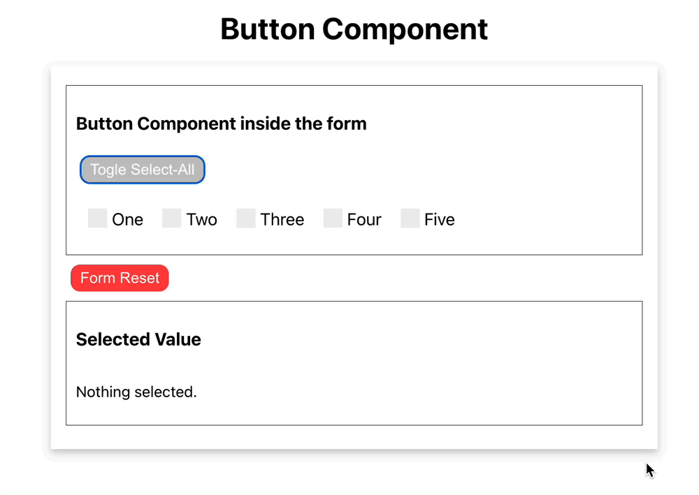

# Button Components with Select All

## Preview



## Overview

- A button component implemented within the form.
- The Reset button is located outside the button component, and the structure is designed so that when the Reset button is clicked in the form, all checkboxes in the child component can be unchecked.

- This is an example of creating a reusable ButtonComponent. It allows selecting all checkboxes via the Select-All-Button and is configured to respond to the Reset button.

- Most of the CSS was created with reference to W3Schools.
  - [Go to W3Schools](https://www.w3schools.com/)

## How to Run

```bash
# First-time setup
$ yarn install

# To start the project
$ yarn run start
```

